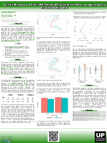

Este póster fue presentado en el Encuentro de Grupos de Investigación sobre Procesamiento del Lenguaje `ProLen 2025` y muestra los resultados de la adaptación rioplatense del ANET.

[Hace click aca para descargar el poster!](https://drive.google.com/uc?id=10cACUbR9Erb0B-PoaGKkeMe1Orxb8caL&export=download)

# El modelo

El modelo de Lang concibe las emociones como predisposiciones para la acción organizadas en tres sistemas de respuesta interrelacionados:

-    **Nivel fisiológico (autonómico)**, encargado de regular reacciones corporales como la frecuencia cardíaca, la conductancia de la piel y la actividad endocrina

-    **Nivel comportamental (motor)**, que se manifiesta en gestos, posturas y expresiones faciales;

-    **Nivel cognitivo (subjetivo)** - Se realiza la evaluación de estímulos en función de las tres dimensiones afectivas: Valencia, Activación y Dominancia.

De este modelo se desprende la confección de estímulos afectivos cuidadosamente calibrados. En el caso de ANET (Affective Norms for English Texts) de Bradley y Lang, se construyen bancos de fragmentos textuales normatizados mediante valoraciones sistemáticas de valencia y activación por parte de muestras de participantes. Cada texto recibe puntuaciones normalizadas que permiten seleccionar pasajes con niveles emocionales precisos, garantizando que activen de forma diferencial los tres sistemas de respuesta descritos por Lang y facilitando comparaciones fiables entre estudios.

La disponibilidad de estímulos afectivos validados resulta esencial para indagar cómo las emociones modulan procesos cognitivos, lingüísticos o sociales. Sin una base normativa rigurosa, sería muy difícil aislar el efecto de la emoción de otras variables (contenido semántico, longitud, idiosincrasias culturales), lo que comprometería la replicabilidad y la solidez de los hallazgos. Al adaptar ANET al español rioplatense, no solo ampliamos el repertorio de textos para investigadores hispanohablantes, sino que también aseguramos que las valoraciones reflejen las connotaciones culturales y lingüísticas de nuestra región, ofreciendo así una herramienta robusta para diseñar experimentos sensibles al contexto local.

# Este trabajo
