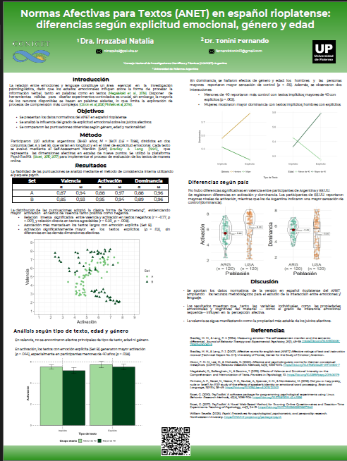
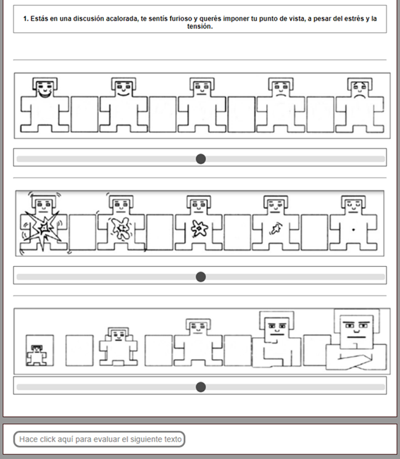

Este póster fue presentado en el Encuentro de Grupos de Investigación sobre Procesamiento del Lenguaje `ProLen 2025` y muestra los resultados de la adaptación rioplatense del ANET.

Autores: `Dra. Natalia Irrazabal` y `Dr. Fernando Tonini`

[Hace click aca para descargar el poster!](https://drive.google.com/uc?id=1aScoukk5AfywedqNu4_hKH8meRl64Nks&export=download)

Tambíen podes mirar el código que usamos para hacerlo

# El modelo

El modelo de Lang concibe las emociones como predisposiciones para la acción organizadas en tres sistemas de respuesta interrelacionados:

-   **Nivel fisiológico (autonómico)**, encargado de regular reacciones corporales como la frecuencia cardíaca, la conductancia de la piel y la actividad endocrina

-   **Nivel comportamental (motor)**, que se manifiesta en gestos, posturas y expresiones faciales;

-   **Nivel cognitivo (subjetivo)** - Se realiza la evaluación de estímulos en función de las tres dimensiones afectivas: Valencia, Activación y Dominancia.

De este modelo se desprende la confección de estímulos afectivos cuidadosamente calibrados. En el caso de ANET (Affective Norms for English Texts) de Bradley y Lang, se construyen bancos de fragmentos textuales normatizados mediante valoraciones sistemáticas de valencia y activación por parte de muestras de participantes. Cada texto recibe puntuaciones normalizadas que permiten seleccionar pasajes con niveles emocionales precisos, garantizando que activen de forma diferencial los tres sistemas de respuesta descritos por Lang y facilitando comparaciones fiables entre estudios.

La disponibilidad de estímulos afectivos validados resulta esencial para indagar cómo las emociones modulan procesos cognitivos, lingüísticos o sociales. Sin una base normativa rigurosa, sería muy difícil aislar el efecto de la emoción de otras variables (contenido semántico, longitud, idiosincrasias culturales), lo que comprometería la replicabilidad y la solidez de los hallazgos. Al adaptar ANET al español rioplatense, no solo ampliamos el repertorio de textos para investigadores hispanohablantes, sino que también aseguramos que las valoraciones reflejen las connotaciones culturales y lingüísticas de nuestra región, ofreciendo así una herramienta robusta para diseñar experimentos sensibles al contexto local.

# Este trabajo

## **Participantes**

Reclutamos a 220 voluntarios argentinos (113 en el conjunto A y 107 en el conjunto B), todos nativos de español rioplatense y con edades entre 18 y 60 años. La muestra quedó equilibrada en cuanto a sexo (46 % hombres, 54 % mujeres) y distribución etaria, tal como indicaba el estudio original de Bradley y Lang.

## **Materiales**

-   **Textos ANET traducidos y adaptados**: Utilizamos 120 fragmentos breves agrupados en dos juegos de 60 (set A con descripciones más concisas e implícitas, set B con versiones más detalladas y explícitas). Algunos textos:

        
> Saltás y bloqueás la pelota de vóley en la red, ganando el juego.

> Estas sentado en el sillón con el control remoto, pasás por los canales de televisión sin ningún propósito.

> El perro se inclina hacia adelante, gruñendo, y de repente salta hacia vos.

Aquí un ejemplo del texto en sus dos versiones:

> Versión implícita: Acabaste de ganar 10 millones de dólares; saltás efusivamente, gritando.

> Versión explícita: Te informan que "¡acabas de ganar diez millones de dólares!" Es increíble: compraste el boleto ganador en la lotería. ¡Lloras, gritas y saltas de alegría! 

-   **SAM (Self-Assessment Manikin)**: Empleamos las escalas pictóricas de 9 puntos para registrar, en cada texto, las valoraciones de valencia (agradable--desagradable), activación (calma--excitación) y dominancia (sumisión--control).

## **Procedimiento de evaluación**

Cada participante accedió en forma remota a través de un enlace a PsyToolKit. Tras firmar el consentimiento informado y completar datos básicos (sexo, edad, nivel educativo), realizó tres ensayos de práctica. A continuación, evaluó los 60 textos de su conjunto asignado en orden aleatorio: por cada texto, eligió en el SAM la puntuación de valencia, activación y dominancia, y luego pasó al siguiente. Toda la sesión tomó entre 12 y 25 minutos, tras lo cual recibieron un breve informe automático y nuestro agradecimiento por su colaboración.
